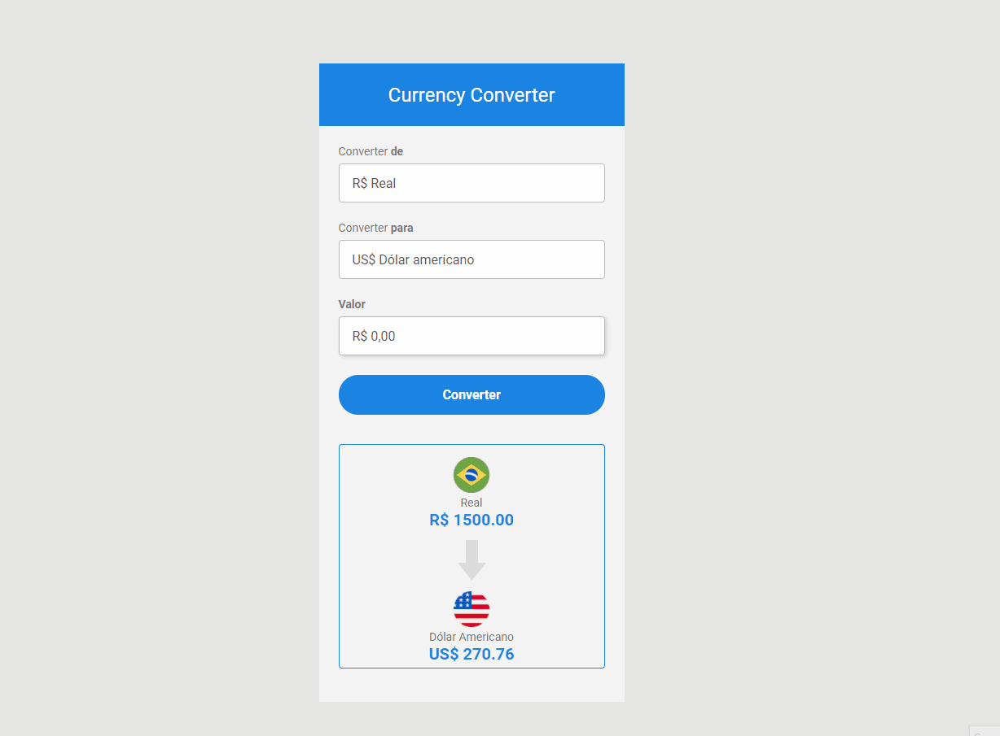

# Currency Converter - Conversor de Moedas

> O projeto é um conversor de moedas. No "converter para" é possível selecionar entre três opções (Dólar Americano, Euro ou Bitcoin) para realizar a conversão de Reais para a moeda escolhida. 

O site no ar pode ser conferido [neste link](https://currency-converter-21.netlify.app).

